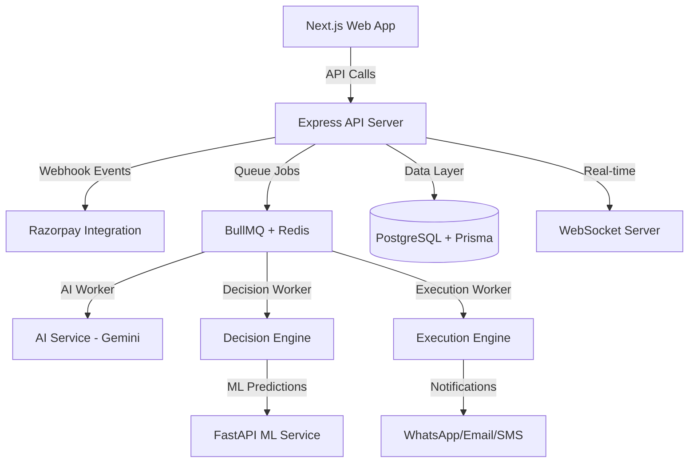

<div align="center">

# 🚀 ReconAI

### AI-Powered Revenue Recovery Platform

<div>
  
  
  
  
  
  
  
</div>

<p align="center">
  <em>Real-time intelligent payment recovery system powered by AI and machine learning</em>
</p>

</div>

---

## 📋 Table of Contents

- [Problem & Solution (STAR)](#-problem--solution-star)
- [Key Features](#-key-features)
- [Tech Stack](#-tech-stack)
- [Architecture](#-architecture)
- [Getting Started](#-getting-started)
- [Project Structure](#-project-structure)
- [API Documentation](#-api-documentation)

---

## 🎯 Problem & Solution (STAR)

### **Situation**
E-commerce businesses face significant revenue loss from failed payments, abandoned carts, and checkout friction. Traditional recovery systems use generic, time-based approaches that lack personalization and often miss optimal recovery windows.

### **Task**
Build an intelligent, real-time revenue recovery platform that:
- Detects payment failures and recovery opportunities instantly
- Uses AI to personalize recovery strategies per customer
- Predicts optimal timing and channels for outreach
- Automates execution while maintaining human oversight

### **Action**
Developed **ReconAI**, a production-grade platform featuring:
- 🧠 **AI Decision Engine** - Google Gemini-powered recovery strategy generation
- 🤖 **ML Prediction Service** - Customer behavior analysis and timing optimization
- ⚡ **Real-time Processing** - Event-driven architecture with BullMQ queues
- 🔄 **State Machine** - Intelligent case management and workflow orchestration
- 📊 **Analytics Dashboard** - Real-time insights and performance tracking
- 🔌 **Payment Integration** - Razorpay webhook processing and payment link generation

### **Result**
A scalable, intelligent system that:
- ✅ Recovers lost revenue through personalized strategies
- ✅ Reduces manual intervention with automated workflows
- ✅ Optimizes recovery timing using ML predictions
- ✅ Provides actionable insights through comprehensive analytics
- ✅ Scales horizontally with microservices architecture

---

## ✨ Key Features

<div align="center">

| Feature | Description |
|---------|-------------|
| 🎯 **Smart Detection** | Real-time identification of payment failures and recovery opportunities |
| 🤖 **AI Strategy Generation** | LLM-powered personalized recovery plans |
| 📈 **ML Predictions** | Success probability scoring and timing optimization |
| ⚡ **Queue Processing** | Async job processing with BullMQ and Redis |
| 🔔 **Multi-channel Outreach** | WhatsApp, Email, SMS integration |
| 📊 **Real-time Analytics** | Customer journey tracking and performance metrics |
| 🔐 **Secure Authentication** | JWT-based auth with role management |
| 🎨 **Modern UI** | Beautiful Next.js dashboard with Tailwind CSS |

</div>

---

## 🛠 Tech Stack

### **Frontend**
<div>
  
  
  
  
  
  
  
</div>

### **Backend**
<div>
  
  
  
  
  
  
  
</div>

### **AI & ML**
<div>
  
  
  
  
</div>

### **Database & Infrastructure**
<div>
  
  
</div>

### **Integrations**
<div>
  
  
</div>

---

## 🏗 Architecture



**Core Components:**
- **Web App** - Next.js dashboard for monitoring and management
- **API Server** - Express backend with REST endpoints and WebSocket
- **AI Service** - LLM-powered recovery strategy generation
- **Decision Engine** - Multi-factor scoring and channel selection
- **Execution Engine** - Action orchestration and idempotency
- **ML Service** - Python-based prediction and analytics
- **Queue System** - Async job processing with retry logic

---

## 🚀 Getting Started

### Prerequisites

- Node.js 20+ and npm
- Python 3.9+ and pip
- PostgreSQL 14+
- Redis 6+

### Installation

1. **Clone the repository**
```bash
git clone https://github.com/yourusername/reconai.git
cd reconai
```

2. **Install dependencies**
```bash
npm install
```

3. **Setup environment**
```bash
cp .env.example .env
# Edit .env with your configuration
```

4. **Initialize database**
```bash
npm run db:push
npm run db:seed
```

5. **Install Python dependencies** (for ML service)
```bash
cd apps/ml-service
pip install -r requirements.txt
```

### Running the Application

**Development mode (all services):**
```bash
npm run dev
```

**Individual services:**
```bash
npm run dev:web      # Next.js app → http://localhost:3000
npm run dev:api      # Express API → http://localhost:4000
npm run dev:ml       # ML service → http://localhost:8000
```

---

## 📁 Project Structure

```
ReconAI/
├── apps/
│   ├── web/                 # Next.js frontend
│   │   ├── src/
│   │   │   ├── app/        # App router pages
│   │   │   ├── components/ # Reusable components
│   │   │   └── lib/        # Utilities & services
│   │   └── package.json
│   │
│   ├── api/                 # Express backend
│   │   ├── src/
│   │   │   ├── ai/         # AI service & prompts
│   │   │   ├── decision-engine/  # Strategy & scoring
│   │   │   ├── execution/   # Action orchestration
│   │   │   ├── integrations/ # External services
│   │   │   └── modules/     # Core business logic
│   │   └── package.json
│   │
│   └── ml-service/          # Python ML service
│       ├── app/
│       │   ├── models/      # ML models
│       │   └── routers/     # FastAPI routes
│       └── requirements.txt
│
├── packages/                # Shared libraries
│   ├── shared-types/       # Common TypeScript types
│   ├── validation/         # Zod schemas
│   └── config/             # Shared configuration
│
└── prisma/                 # Database schema & migrations
```

---

## 📡 API Documentation

### **Authentication**
```bash
POST /api/auth/login
POST /api/auth/register
```

### **Webhooks**
```bash
POST /api/webhooks/razorpay  # Payment event processing
```

### **Recovery**
```bash
GET  /api/recovery/cases          # List all recovery cases
GET  /api/recovery/cases/:id      # Get case details
POST /api/recovery/cases/:id/action  # Execute action
GET  /api/recovery/analytics      # Analytics dashboard data
```

### **Development**
```bash
POST /api/dev/trigger-event      # Simulate events (dev only)
```

---

<div align="center">

### 🌟 Built with passion for intelligent revenue recovery

**[Documentation](./docs)** • **[Contributing](./CONTRIBUTING.md)** • **[License](./LICENSE)**

</div>
